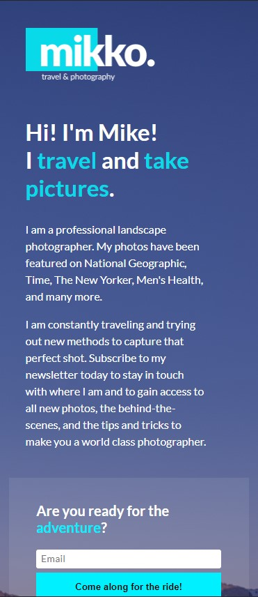
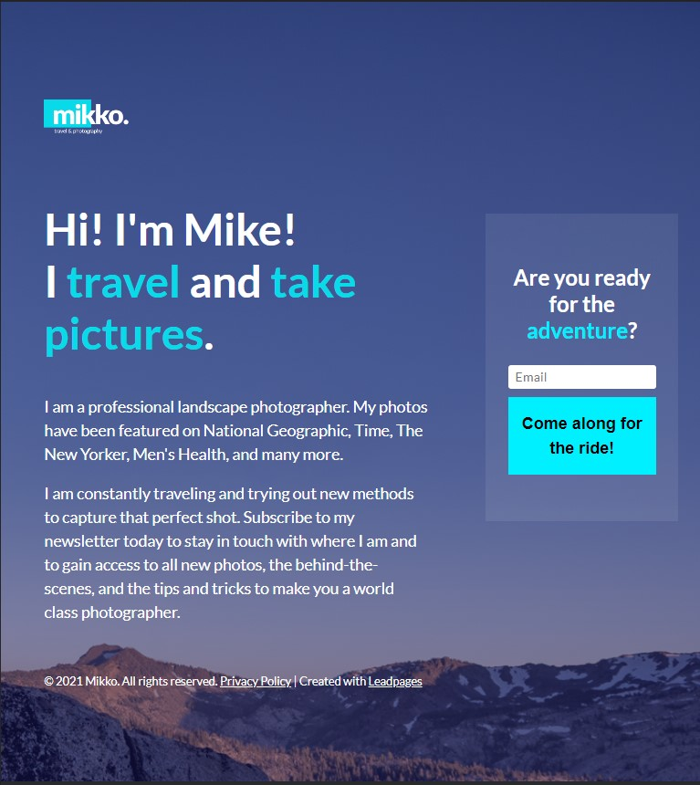
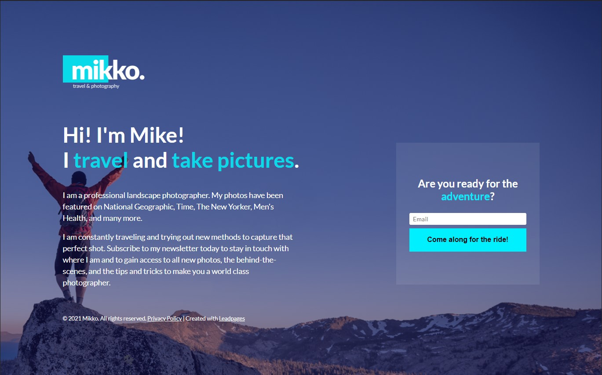

# Simple Lead Capture Clone<!-- omit in toc -->

This is a clone for the Simple Lead Capture Landing Page Template found on the leadpages.com.

## Version 1.00<!-- omit in toc -->

- **Project Start:** August 31, 2021
- **Project End:** Sept. 9, 2021 

# CONTENTS
- [CONTENTS](#contents)
  - [Introduction](#introduction)
  - [Screenshots](#screenshots)
    - [MOBILE](#mobile)
    - [TABLET](#tablet)
    - [DESKTOP](#desktop)
  - [Methodology](#methodology)
  - [Tools I Used](#tools-i-used)
  - [What I learned](#what-i-learned)
  - [Items for further study](#items-for-further-study)
  - [Helpful Resources](#helpful-resources)
  - [About me](#about-me)
 

Introduction
---
In my quest to improve my landing page design prowess, I chose to make a clone of a simple landing page from leadpages.com.

The original can be [found here](https://www.leadpages.com/templates/preview/9qXXtSSH7WDpG9q7Y3gSNM).

 

Screenshots
---

### MOBILE

### TABLET

### DESKTOP

 

Methodology
---

After noting some of the basic styles for the page in my Browser's Dev Tools, I scaffolded the layout in HTML and added the Styles in CSS. Worked on JavaScript last.

 

Tools I Used
---

- HTML5
- CSS3
- JavaScript ES6
- Mobile-Friendly development

 

What I learned
---

The trickest part for me was with the animated portions (the loading wheel upon submission, and the checkmark). I saw in the Dev Tools that those icons were nested elements inside the button, but I found it was easier put them in a parent div container, use CSS to position it, then manipulate its visibility using JavaScript (using EventListeners to listen for the end of animation and transition before taking the next action).

 

Items for further study
---

Animation, animation, ANIMATION! Whilst I did a quick course on animation on [Scrimba's Learning Platform](https://scrimba.com/learn/cssanimations), there's still a heck of a lot to learn!

I also started learning Sass, and once I get a better feel for it, I will definitely revisit this project and get things tidier.

 

Helpful Resources
---

- [Create a Custom SVG Checkbox (Animated AND Accessible!)](https://www.youtube.com/watch?v=46iQVS7WddE): Gary Simon is one of my fave instructors in the realm of UX/UI design, and this tutorial help me get a better idea on how to go about animate the checkmark.

- [Pure CSS Loaders](https://loading.io/css/): site where I found the loading spinner used.

 

About me
---

Thanks for checking out this project! 😃 You can find my profiles at these sites:
- [Personal Website](https://www.sonjigoodman.com/)
- [Twitter: @IT_Sonji](https://twitter.com/sonji_it)
- [Frontend Mentor - @infinity-Mineeva](https://www.frontendmentor.io/profile/Infinity-Mineeva)
